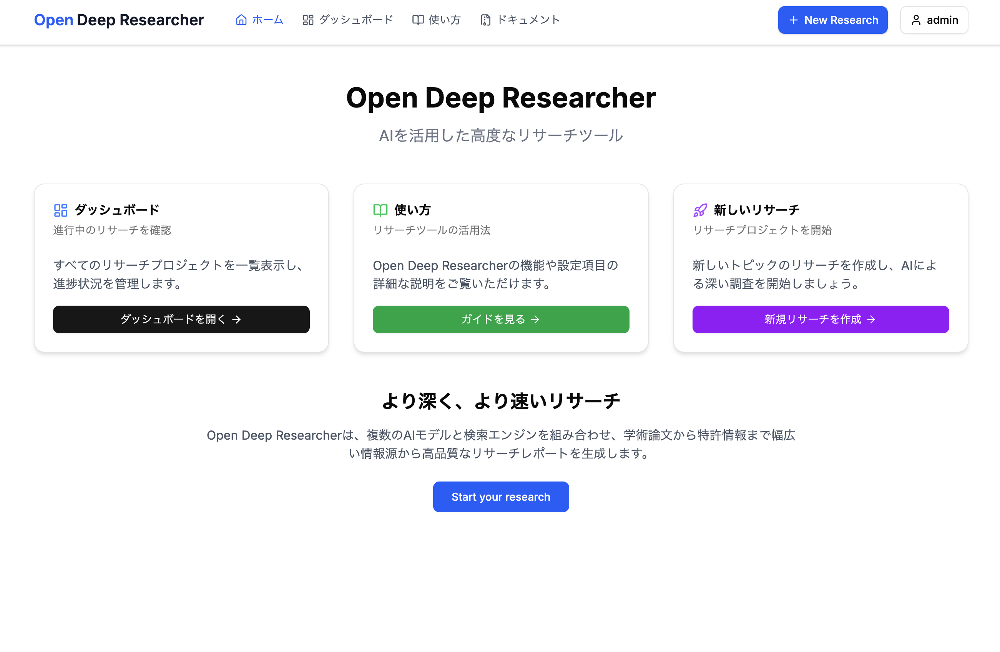
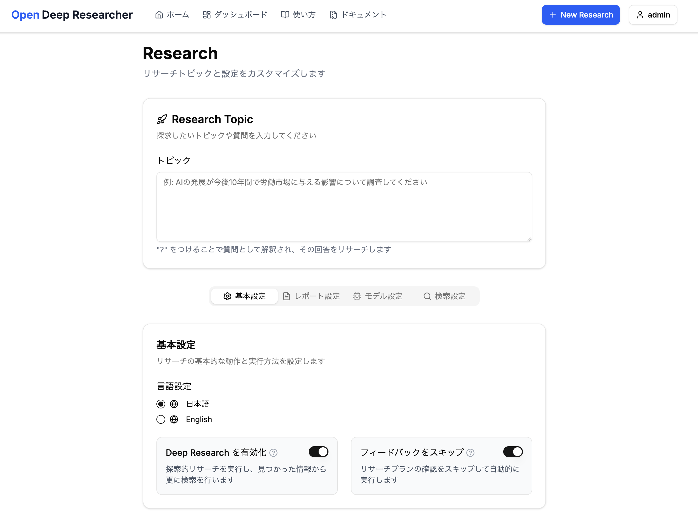
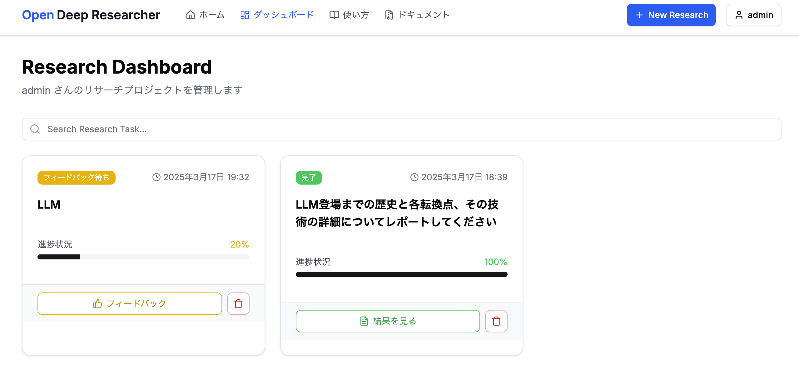
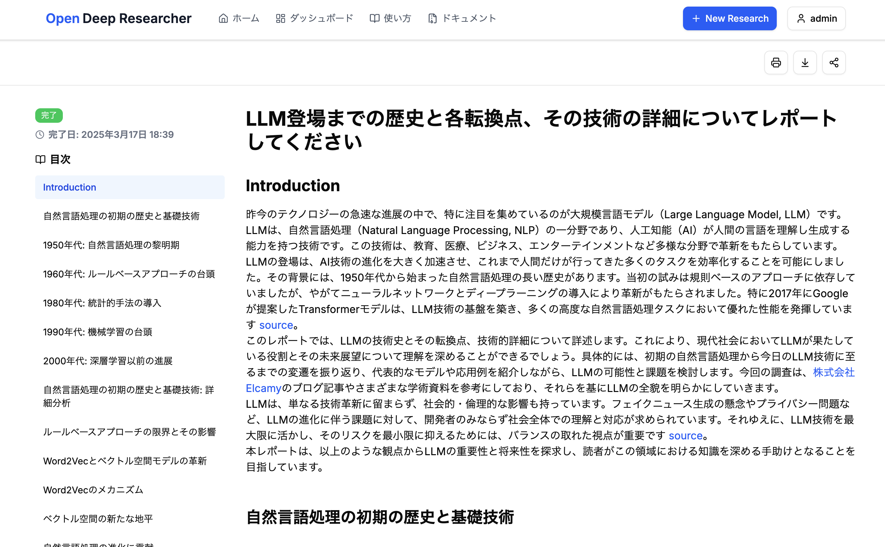

# Open Deep Researcher

An intelligent research assistant that performs in-depth research on any topic and generates comprehensive reports with minimal human intervention.

## Features

- **Comprehensive Research**: Automatically researches topics by querying multiple data sources
- **Multi-source Search**: Integrates with Tavily for web search, arXiv for academic papers, and local document search
- **Interactive Feedback**: Request feedback on research plans before execution
- **Structured Reports**: Generates well-organized reports with introduction, structured sections, and conclusion
- **Deep Research Capability**: Dynamically explores subtopics in depth when enabled
- **Document Management**: Upload and manage your own documents for research
- **Multi-user Support**: Separate workspaces and research history for different users

## Architecture

Open Deep Researcher is built with a modern, scalable architecture:

- **Backend**: FastAPI application providing RESTful API endpoints
- **Research Engine**: Built on LangGraph for orchestrating complex research workflows
- **Storage**: Local storage for documents and SQLite for research results
- **Search Providers**: Flexible integration with web and local search mechanisms

## Getting Started

### Prerequisites

- Python 3.11+
- Docker and Docker Compose (optional)
- API keys for:
  - OpenAI
  - Anthropic (optional)
  - Tavily

### Installation

#### Option 1: Docker Compose (Recommended)

1. Clone the repository
2. Configure environment variables
   ```bash
   cp backend/.env.example backend/.env
   # Edit backend/.env with your API keys
   ```
3. Start the services
   ```bash
   docker-compose up -d
   ```
4. Access the service at http://localhost:3000

#### Option 2: Local Development

1. Clone the repository
2. Setup backend:

   ```bash
   cd backend
   cp .env.example .env
   # Edit .env with your API keys

   # Install uv package manager
   curl -LsSf https://astral.sh/uv/install.sh | sh
   uv venv

   # Install dependencies
   uv pip install -r requirements.txt
   uv pip install --editable ../

   # Activate virtual environment
   source .venv/bin/activate

   # Start the backend
   uvicorn app.main:app --reload
   ```

3. Setup frontend (in a separate terminal):
   ```bash
   cd frontend
   npm run dev
   ```

---









---

### Running LangGraph Studio UI Locally

LangGraph Studio provides a visual interface to debug and develop the research workflow:

1. Clone the repository:

   ```bash
   git clone https://github.com/osushinekotan/open-deep-researcher.git
   cd open-deep-researcher
   ```

2. Configure environment variables:

   ```bash
   cp .env.example .env
   # Edit .env with your API keys
   ```

3. Install dependencies and start the LangGraph server:

   ```bash
   # Install uv package manager
   curl -LsSf https://astral.sh/uv/install.sh | sh

   # Install dependencies and start the LangGraph server
   uv sync
   uv run langgraph dev
   ```

4. Once the server is running, you'll see:

   ```
           Welcome to

   ╦  ┌─┐┌┐┌┌─┐╔═╗┬─┐┌─┐┌─┐┬ ┬
   ║  ├─┤││││ ┬║ ╦├┬┘├─┤├─┘├─┤
   ╩═╝┴ ┴┘└┘└─┘╚═╝┴└─┴ ┴┴  ┴ ┴

   - 🚀 API: http://127.0.0.1:2024
   - 🎨 Studio UI: https://smith.langchain.com/studio/?baseUrl=http://127.0.0.1:2024
   - 📚 API Docs: http://127.0.0.1:2024/docs
   ```

5. Access the Studio UI by clicking the URL or copying it to your browser

## API Endpoints

The backend provides the following API endpoints:

### Research

- `POST /api/research/start`: Start a new research
- `GET /api/research/{research_id}/status`: Get research status
- `GET /api/research/{research_id}/plan`: Get research plan for feedback
- `GET /api/research/{research_id}/result`: Get completed research results
- `GET /api/research/list`: List all research jobs
- `DELETE /api/research/{research_id}`: Delete a research job

### Feedback

- `POST /api/feedback/submit`: Submit feedback on research plan

### Documents

- `POST /api/documents/upload`: Upload documents
- `GET /api/documents/list`: List uploaded documents
- `DELETE /api/documents/{filename}`: Delete a document
- `PUT /api/documents/{filename}/enable`: Enable/disable document for research

### Users

- `POST /api/users/create`: Create a new user
- `POST /api/users/login`: Login with username
- `GET /api/users/{username}`: Get user information
- `GET /api/users/{username}/researches`: Get user's research history
- `GET /api/users/{username}/documents`: Get user's documents

## Configuration

The system can be configured with various parameters to customize the research process:

- Search providers selection and configuration
- Research depth and breadth
- Section limits and word count constraints
- Language model selection
- Output language preference
